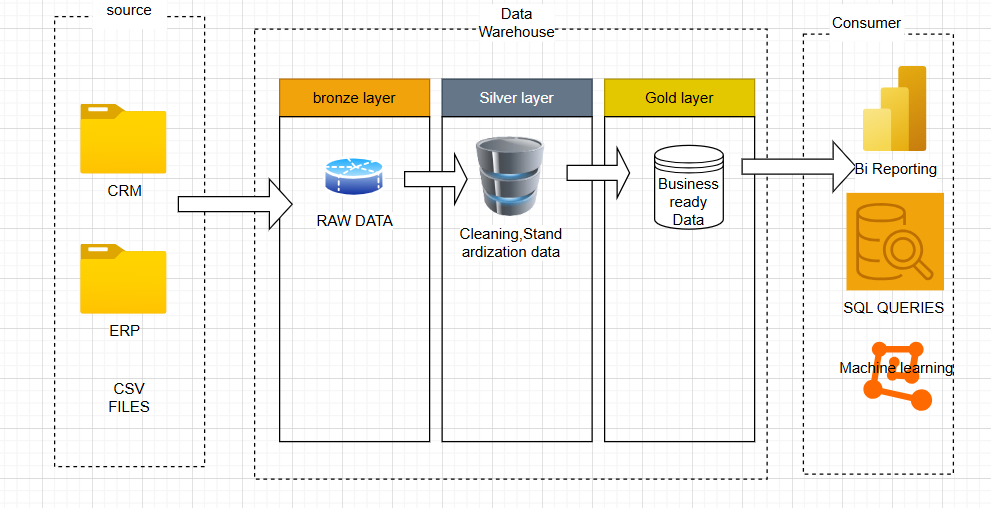

# Data Warehouse and Analytics Project

Welcome to the **Data Warehouse and Analytics Project** repository! 🚀  
This project demonstrates a complete data warehousing and analytics workflow, from building a modern data warehouse to generating actionable insights. Designed as a portfolio project, it highlights industry best practices in **data engineering** and **analytics**.

---

## 🏗️ Data Architecture

This project follows **Medallion Architecture** with **Bronze**, **Silver**, and **Gold** layers:

1. **Bronze Layer**: Stores raw data from source systems (CSV files) in SQL Server.  
2. **Silver Layer**: Cleans, standardizes, and normalizes the data for analytics.  
3. **Gold Layer**: Contains business-ready data, modeled into a star schema for reporting.

---

## 📖 Project Overview

Key components of the project:

1. **Data Architecture**: Designing a modern data warehouse using Bronze, Silver, and Gold layers.  
2. **ETL Pipelines**: Extracting, transforming, and loading data into the warehouse.  
3. **Data Modeling**: Creating fact and dimension ta
